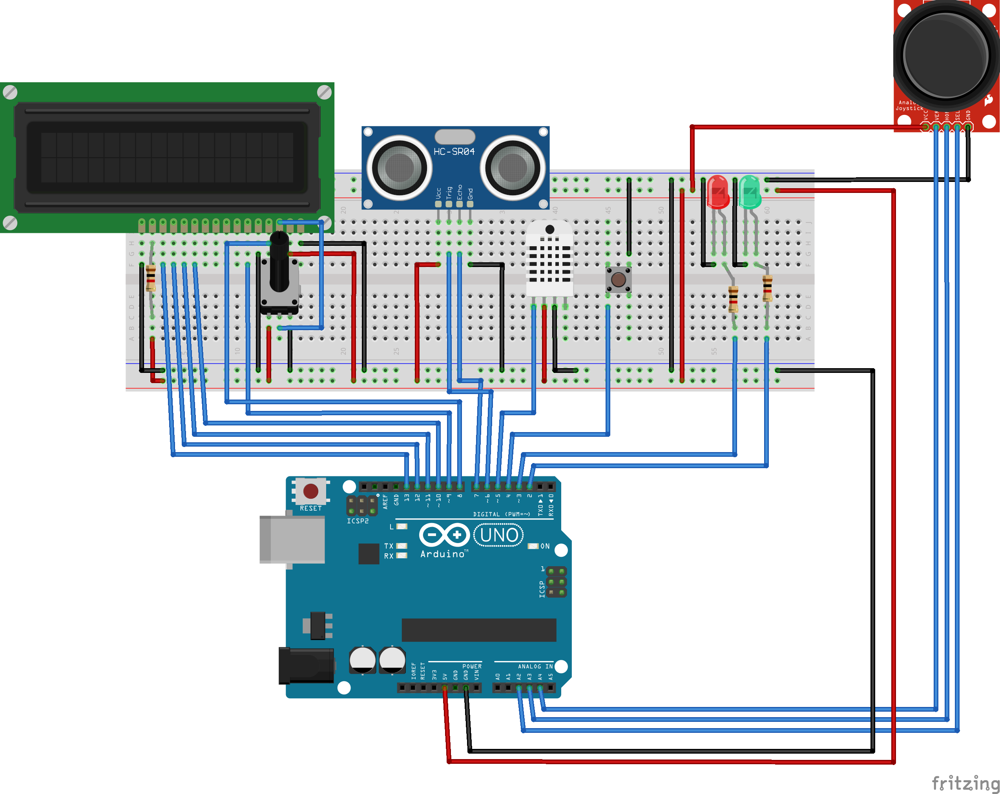

# practica3-SETR
Información sobre la practica 3 de la asignatura Sistemas Empotrados y de Tiempo Real

## Mi Solución
He implementado en este sistema usando todo lo aprendido en clase.
- Para actualizar datos globales tal como sensores y el conteador de tiempo, he utilizado threads. Además de para eso también para implementar en parpadeo inicial del LED, con el fin de usar menos recursos (menos delays).
- Para evitar bloques inesperados, he usado watchdog (8s), reseteandolo en casos en los que espero que el sistema pase más de 8 segundos sin volver a empezar el bucle. Más de una vez watchdog ha reiniciado la placa cuando era necesario y me quedaba bloqueado en algún estado de la máquina expendedora.
- Para el funcionamiento de los botones, he usado las interrupciones hardware de los pines de arduino UNO. Con ellos detecto cuando el boton cambia de estado (CHANGE). Dentro de la función llamada tras este cambio diferencio entre FALLING y RISING dependiendo del estado actual del botón. En el primer caso guardo el tiempo (en ms) actual y en el segundo comparo ese tiempo con el nuevo, para ver si han pasado los 3 o 5 segundos requeridos. No es posible utilizar delays o utilizar comunicación, por lo que el código en esta función se basaba en guardar/comparar datos y cambiar flags.
- Para evitar rebotes en las señales de entrada me he limitado a utilizar delays. En algunos casos parecen delays excesivos pero son los necesarios para que la navegación por el menu mostrado en el display sea óptima.

## Video Explicativo
[video](https://urjc-my.sharepoint.com/personal/ja_gutierrezc_2022_alumnos_urjc_es/_layouts/15/stream.aspx?id=%2Fpersonal%2Fja%5Fgutierrezc%5F2022%5Falumnos%5Furjc%5Fes%2FDocuments%2Fempotrados%2Emov%2Emov&referrer=StreamWebApp%2EWeb&referrerScenario=AddressBarCopied%2Eview%2Eccd5d2e2%2D1722%2D46ea%2Dae09%2D25daf1e48927)
## Esquema Circuito

